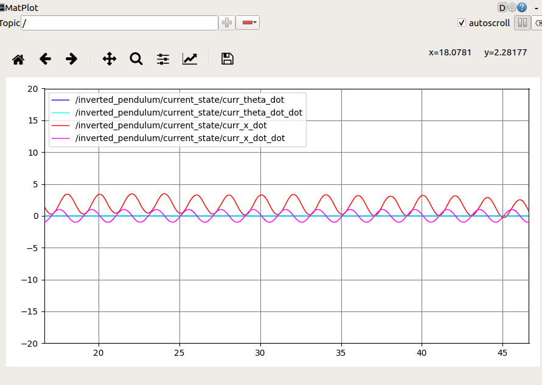

# Octobotics Coding Assignment

This Github repository provides a base inverted pendulum simulation to be used as-is for the purposes of this assignment


### Dependencies

- [`pygame`](https://pypi.org/project/pygame/)

```bash
pip install pygame
```

- [`rospy`](http://wiki.ros.org/rospy)
- [`catkin_tools`](https://catkin-tools.readthedocs.io/en/latest/installing.html)

```bash
sudo apt-get install python3-catkin-tools
```

### Usage

- clone the repository

```bash
git clone https://github.com/Lokesh-Panwar/Octobotics_Coding_Assignment.git
```

- navigate to the repository directory

```bash
cd Octobotics_Coding_Assignment
```

- build the project

```bash
catkin_make
```
- source the workspace

```bash
source devel/setup.bash
```
- Don't forgot to source all the terminal by above command.
- launch the simulation using roslaunch

```bash
roslaunch inverted_pendulum_sim inverted_pendulum_sim.launch
```
**Goal1:** 
- Set the parameter of pendulum by calling ros service /inverted_pendulum/set_params in new terminal

```bash
source ~/Octobotics_Coding_Assignment/devel/setup.bash
rosservice call /inverted_pendulum/set_params (double tab)
```
- You will get the following 

```bash
rosservice call /inverted_pendulum/set_params "{pendulum_mass: 0.0, pendulum_length: 0.0, cart_mass: 0.0, theta_0: 0.0, theta_dot_0: 0.0,
  theta_dot_dot_0: 0.0, cart_x_0: 0.0, cart_x_dot_0: 0.0, cart_x_dot_dot_0: 0.0}" 
```
- Change the required parameter such as: pendulum_mass: 2.0, pendulum_length: 300.0, cart_mass: 0.5
- Observe the Simulation

**Goal2:**
- Open a new terminal
```bash
source ~/Octobotics_Coding_Assignment/devel/setup.bash
rosrun inverted_pendulum_sim sin_force.py
```
-In new terminal run 
```bash
rqt_plot
```
Substract the unwanted data from red color '-' sign and observe the graph


**Goal3**
Terminate the program of Goal2 by ctrl+C

```bash
rostopic pub -r00 /inverted_pendulum/control_force inverted_pendulum_sim/ControlForce  0
```

- Call the ROS serive and change the initial angle of pendulum to pi=3.1415.

```bash
rosservice call /inverted_pendulum/set_params(double tab) "{pendulum_mass: 2.0, pendulum_length: 300.0, cart_mass: 0.5, theta_0: 3.1415, theta_dot_0: 0.0,
  theta_dot_dot_0: 0.0, cart_x_0: 0.0, cart_x_dot_0: 0.0, cart_x_dot_dot_0: 0.0}" 
```
-Before vertical pendulum drop in simulation, run the folloing command
```bash
rosrun inverted_pendulum_sim pid_controllerith_class.py 
```
Now try to disturb the stable pendulum by calling ros service /inverted_pendulum/set_params and changing paramenter like, theta,theta_dot_dot_0, cart_x_0, cart_x_dot_0.

- Observe the Results

### Published Topics
- /inverted_pendulum/current_state ([inverted_pendulum_sim/CurrentState](https://github.com/octobotics/Octobotics_Coding_Assignment/blob/main/src/inverted_pendulum_sim/msg/CurrentState.msg)) - Publishes the current state of the inverted pendulum at 100 Hz
 
### Subscribed Topics
- /inverted_pendulum/control_force ([inverted_pendulum_sim/ControlForce](https://github.com/octobotics/Octobotics_Coding_Assignment/blob/main/src/inverted_pendulum_sim/msg/ControlForce.msg)) - Subscribes to the control force input to the inverted pendulum

### Services
- /inverted_pendulum/set_params ([inverted_pendulum_sim/SetParams](https://github.com/octobotics/Octobotics_Coding_Assignment/tree/main/src/inverted_pendulum_sim/src) - Sets the parameters and initial conditions of the inverted pendulum

###
Thanks for your time and paitence
Good Luck, See you next time
